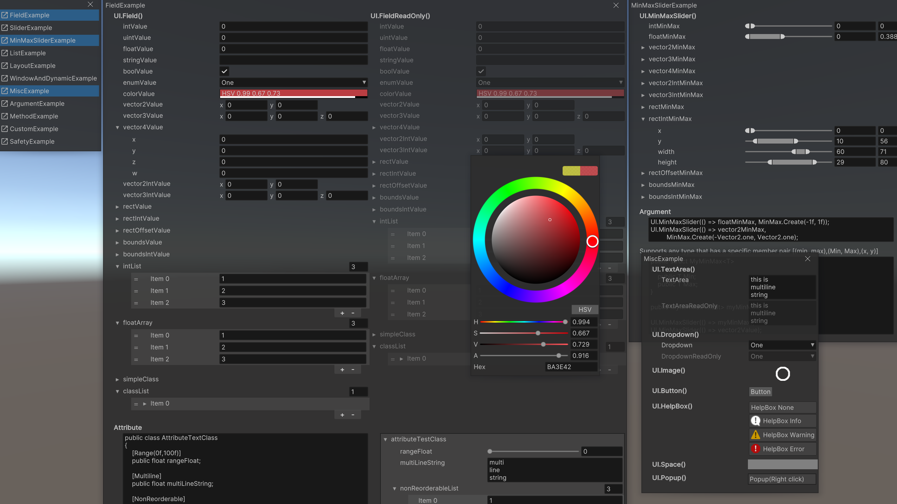
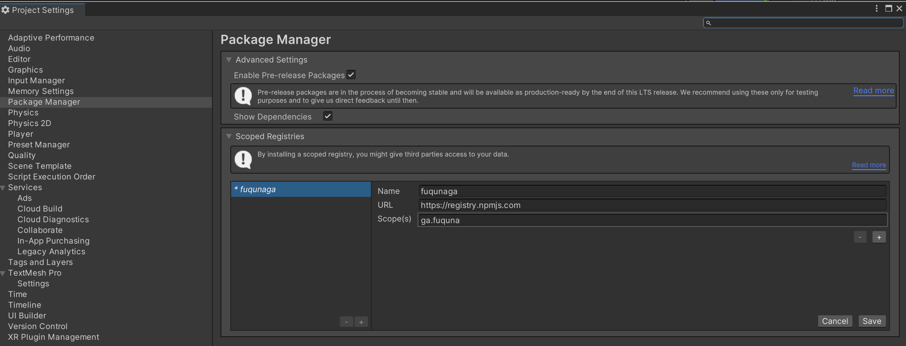
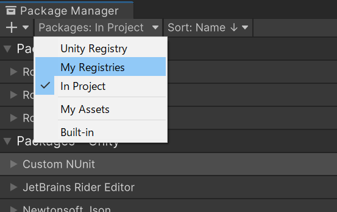
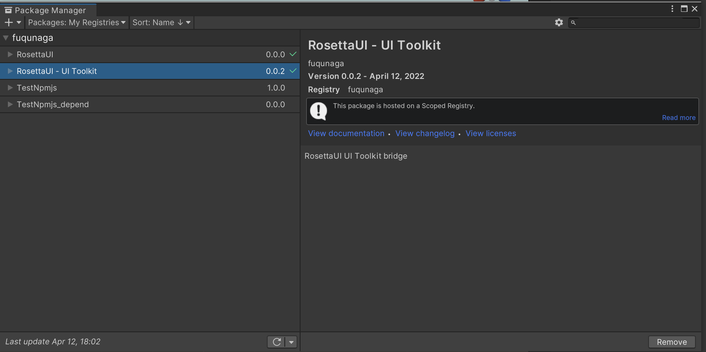
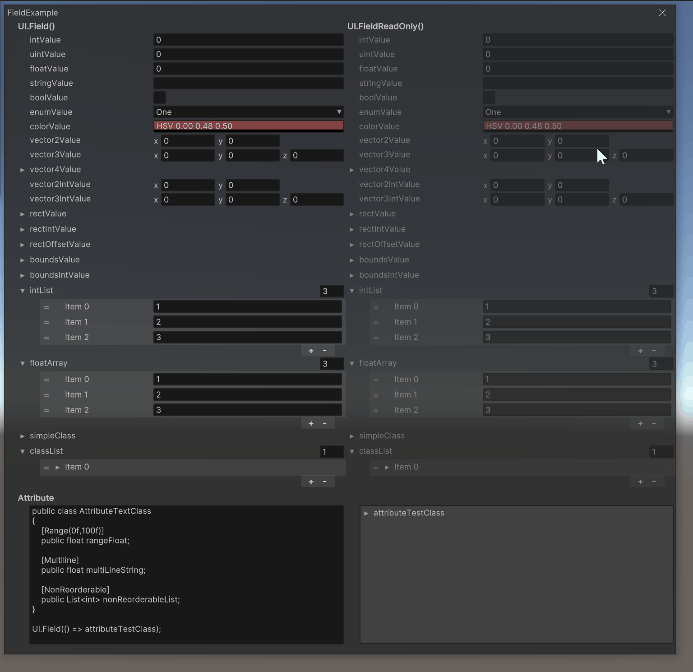
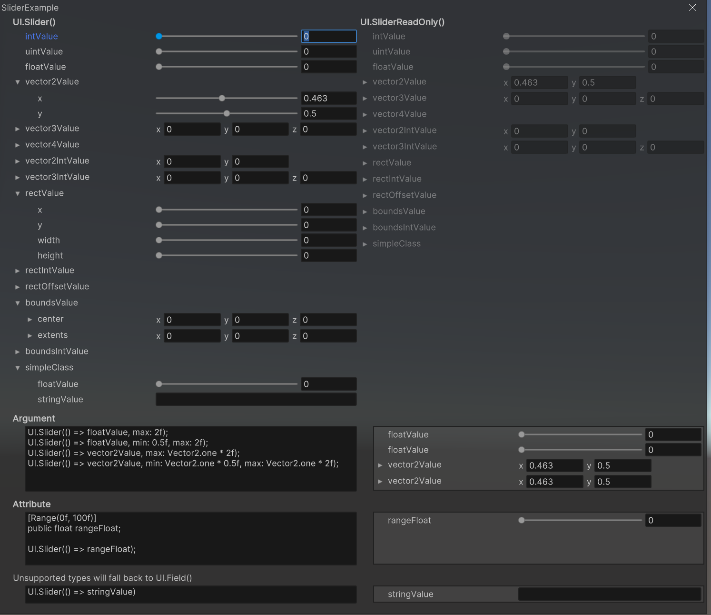
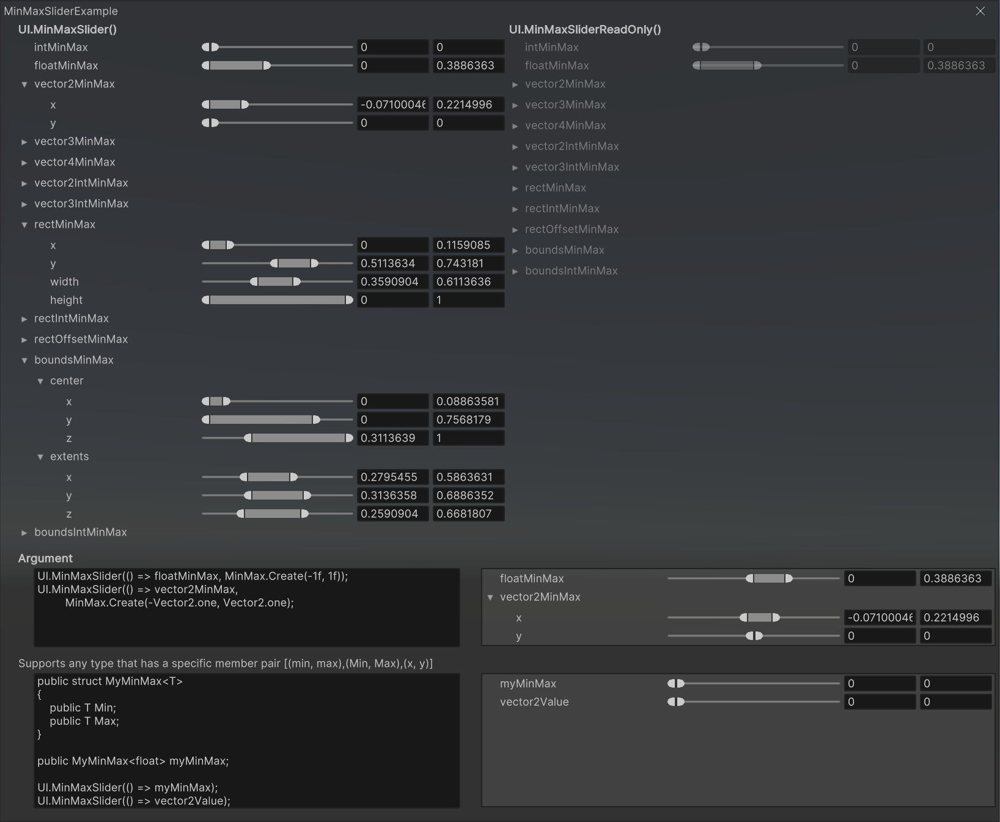
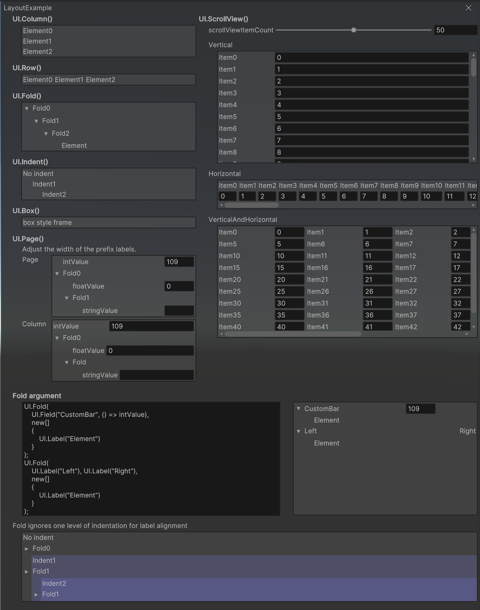

# RosettaUI

Code-based GUI library for development menus for Unity




<table>
<td width=450>

```csharp
public class ExampleSimple : MonoBehaviour
{
    public string stringValue;
    public float floatValue;
    public int intValue;
    public Color colorValue;

    
    void Start()
    {
        var root = GetComponent<RosettaUIRoot>();
        root.Build(CreateElement());
    }

    Element CreateElement()
    {
        return UI.Window(nameof(ExampleSimple),
            UI.Page(
                UI.Field(() => stringValue),
                UI.Slider(() => floatValue),
                UI.Row(
                    UI.Field(() => intValue),
                    UI.Button("+", () => intValue++),
                    UI.Button("-", () => intValue--)
                ),
                UI.Field(() => colorValue)
            )
        );
    }
}
```

</td>
<td>


</td>
</tr>
</table>


# Installation

This package uses the [scoped registry] feature to resolve package
dependencies. 

[scoped registry]: https://docs.unity3d.com/Manual/upm-scoped.html


**Edit > ProjectSettings... > Package Manager > Scoped Registries**

Enter the following and click the Save button.

```
"name": "fuqunaga",
"url": "https://registry.npmjs.com",
"scopes": [ "ga.fuquna" ]
```



**Window > Package Manager**

Select `MyRegistries` in `Packages:`



Select `RosettaUI - UI ToolKit` and click the Install button



# How to use

1. Put `Packages/RosettaUI - UIToolkit/RosettaUIRootUIToolkit.prefab` in the Hierarychy
1. Write code to generate `Element` instance
1. Call `RosettaUIRoot.Build(Element)` to generate the actual UI ( [Example] )

[Example]: Assets/Example/ExampleSimple.cs

Examples are available in this repository.
I recommend downloading and checking it out.


# Functions

### UI.Field()



### UI.Slider()


### UI.MinMaxSlider()



### Layout elements


### And more
Please check the [Examples](Assets/Example/Common)

# Enviroment

| Platform | Status            |
| -------- | ----------------- |
| Windows  | ✔                 |
| Mac      | Maybe(not tested) |
| Linux    | Maybe(not tested) |
| IL2CPP   | Suspended         |

| UI Library | Status      |
| ---------- | ----------- |
| UI Toolkit | ✔           |
| UGUI       | Suspended   |
| IMGUI      | Not planned |


# See also

[PrefsGUI](https://github.com/fuqunaga/PrefsGUI) - Accessors and GUIs for persistent preference values using a JSON file