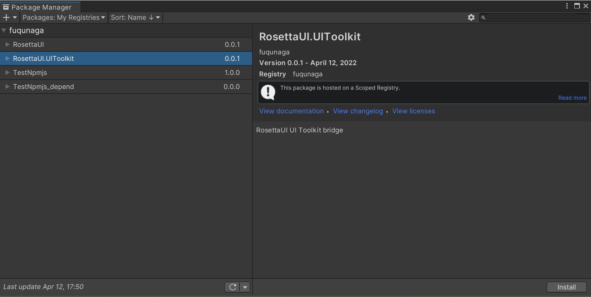

# RosettaUI

Code-based GUI library for development menus for Unity


## Installation

This package uses the [scoped registry] feature to resolve package
dependencies. 

[scoped registry]: https://docs.unity3d.com/Manual/upm-scoped.html


### Setting Scoped Registry

**Edit > ProjectSettings... > Package Manager > Scoped Registries**

Enter the following and click the Save button.

```
"name": "fuqunaga",
"url": "https://registry.npmjs.com",
"scopes": [ "ga.fuquna" ]
```


### Install via Package Manager

**Window > Package Manager**

Select `MyRegistries` in `Packages:`


Select `RosettaUI.UIToolKit` and click the Install button



## How to use